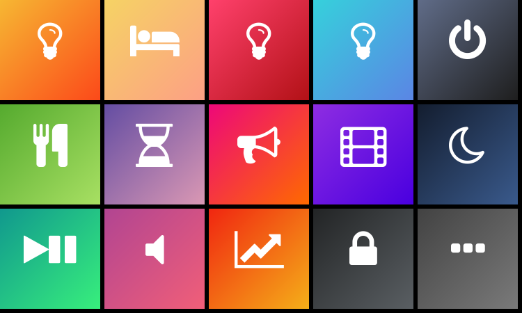

# Elgato Stream Deck

Installed 2026-09-26 at the owner's request for a **Stream Deck MK.2**
(USB `0FD9:0080`). The owner plugged it into the LG UltraFine monitor, which
peecee shares with archon.

## Install

```powershell
winget install --id Elgato.StreamDeck --exact --silent --accept-package-agreements --accept-source-agreements
```

- Package `Elgato.StreamDeck` 7.6.0.23012 (publisher Corsair Memory, Inc.).
  MSI from `edge.elgato.com`, and winget verified the installer hash.
  Dependency: `Microsoft.VCRedist.2015+.x64`.
- The app talks to the deck over standard HID and needs no separate kernel
  driver.
- Install path: `C:\Program Files\Elgato\StreamDeck\`. It also installs the
  Volume Controller plugin under `C:\Program Files\Elgato\Volume Controller\`.

## Startup entries added (`halbr` Run key)

| Name | Command |
| --- | --- |
| Stream Deck | `"C:\Program Files\Elgato\StreamDeck\StreamDeck.exe" --runinbk` |
| Volume Controller SD plugin | `C:\Program Files\Elgato\Volume Controller\ElgatoAudioControlServerWatcher.exe` |

No services or Scheduled Tasks were added.

## Launching from SSH

Installing from SSH started the Volume Controller in session 0. Those copies
were stopped. Both programs were then started in `halbr`'s desktop session
(session 1) with a temporary Interactive-logon Scheduled Task, which was
deleted afterwards. Use one task per program, because a task runs its actions
one after another and the Watcher never exits.

## Monitor USB routing

The LG 32U990A (UltraFine evo 6K) is shared by peecee and archon:

- **Archon:** Thunderbolt 5 upstream (its kernel logs Thunderbolt port 0:5).
- **Peecee:** DisplayPort video plus a USB link. Peecee sees the monitor's
  control device (`043E:9A39`, serial `601INZY73733`) through motherboard hub
  port 10.

The deck was first plugged into the monitor's **Thunderbolt 5 downstream**
(daisy-chain) port. It enumerated on archon behind a Fresco Logic `1D5C:5801`
hub, next to the monitor's `0451:ACE1` device. It stayed on archon while
archon's DisplayPort output was in DPMS Off. Toggling the OSD **USB Selection**
didn't disconnect that hub either. Archon's kernel logged no hub disconnect.
Conclusion: the Thunderbolt downstream port follows the Thunderbolt host, not
the monitor's KVM/USB Selection. Use the monitor's USB-C 3.2 downstream ports,
or peecee's own ports, for devices that belong to peecee.

The owner then moved the deck. At 2026-09-26 22:46, peecee enumerated it
(`USB\VID_0FD9&PID_0080\A00SA6102QCGR8`) through Genesys `05E3:0610` hubs
under root hub port 10. The Stream Deck app log reported `Device connected`,
firmware 1.02.000. Archon no longer listed it. Verify with:

```powershell
Get-PnpDevice -PresentOnly | Where-Object InstanceId -match 'VID_0FD9'
```

## Home page (2026-09-26)

At the owner's request, the Default Profile's first page is now **Home**
(page `1b250ea7-b9f9-4159-98e4-69bae04e5a3c`). Elgato's original pages follow
it: **More ›** goes forward, and **‹ Home** (added at 3,2 on the old first page
`8b6f2ad7…`) comes back.



| Row | Keys |
| --- | --- |
| Lights | Desk Lamp, Bed Lamp, Red Light, Hall Light (toggles) · Living Off |
| House | Dinner, Bedtime, Come Here (Luna announcements to the kid's room) · Movie · Goodnight |
| Desk | Play/Pause · Mute · Grafana (`http://100.85.100.81:3003/`) · Lock PC · More › |

Home keys use the built-in Website action with `openInBrowser: false`. That
sends a background HTTP GET to a local-only Home Assistant webhook, so peecee
stores no HA token. The Home Assistant side is documented in
[devices/home-assistant-fernside/.../stream-deck.md](../../../../devices/home-assistant-fernside/config/home-assistant-core/stream-deck.md).
Lock PC opens `C:\ProgramData\Infra\streamdeck\Lock peecee.lnk`
(`rundll32.exe user32.dll,LockWorkStation`), because Windows ignores a
synthesized Win+L. The approved plan had a Clock key in position 4,2; it became
**More ›**, because otherwise nothing on Home could reach the other pages.

Settings keys for the built-in actions weren't documented anywhere on the host.
They were confirmed as follows:

- Website `openInBrowser`: strings in `StreamDeck.exe`.
- Multimedia `actionIdx`: the stock page (4 = mute, 5 = volume up,
  6 = volume down, judged from their icons). 0 = play/pause is inferred from
  that ordering. Press it to confirm.

### Rebuild / reinstall

1. On proximal, run `build-home-page.py` in a scratch directory. It writes
   `sdpage/` and a preview.
2. On peecee, stop `StreamDeck.exe`, because it rewrites profiles on exit.
3. Copy `sdpage/` to
   `%APPDATA%\Elgato\StreamDeck\ProfilesV3\19AA5BBE-4064-4752-91FB-3FCD16C7B859.sdProfile\Profiles\<PAGE-UUID>\`.
   Remove `back-action.json`.
4. Make the page first and `Current` in that profile's `manifest.json`
   (`Pages.Pages`). Write the JSON as UTF-8 without a BOM.
5. Relaunch in the desktop session. Use a temporary Interactive-logon
   Scheduled Task, as above.

Profiles backup taken before the change:
`C:\ProgramData\Infra\streamdeck\ProfilesV3-before-20260926.zip`.
Rollback: stop the app and restore that folder.

End-to-end test on 2026-09-26 23:36: the Red Light webhook was fired twice
from peecee. Both automation runs finished, and the light went on and back
off. The physical keys themselves had not yet been pressed by the owner.
